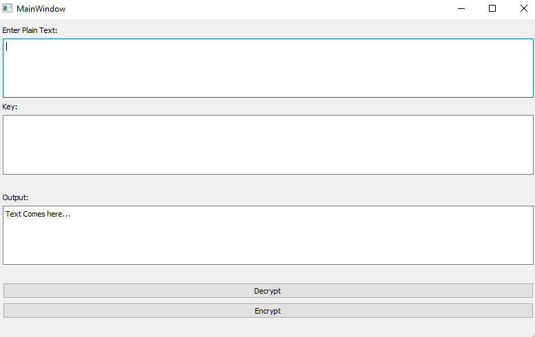

# Encryption-App
As a part of my 7th Sem CNS Project, I have made a small python UI and a custom encryption and decryption algo for text. 

# How to use
<hr>
* Using this app is fairly simple:
* Just to go to .\Encryption App (exe)\app and run "app.exe" file.

# Modifications:
<hr>
* You can add your own endcyption and decryption algorithms by modifying the content of .\Algo\cns.py file. <br>
* You just need to change the body of function ```encpt()``` to add your own encryption finction and to add your own decryption function, change the content of ```dcpt()```. <br>
* YOU NEED NOT CHANGE ANYTHING IN THE UI. <br>
* __NOTE__ : It is compulsory for both the functions to return string in order for the code to work properly. 

# Screenshot:

